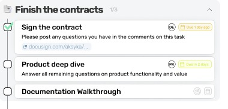

# Example Full-Stack Challenge

We're excited that you're interested in performing the coding challenge.
The purpose of this test is to see how you approach problems as well as to evaluate the quality of your code.

## Challenge description

This challenge imagines that we have a screen that displays a single phase on an onboarding workflow.

It consists of a RESTful backend that exposes a single endpoint that when given an ID, it returns the phase by that ID

It consists of a frontend that calls the backend with the ID `b762e005-b762-485f-8f7e-7229d4b7622` and renders the phase onto the page according to the below screen

The UI should look something like:

## Instructions
- Please don't spend more than *4 hours**.
- Choose whatever **NodeJS** framework you are comfortable with and that lets you achieve a solution in the given time limit. Please nothing too esoteric.
- For the frontend, please use **React JS** in whatever wrapper framework or state management library you like using
- Provide the solution source code as a link to the code repository

## What we're looking for:
- Crisp UI
- Code quality
- Technical choices
- A runnable full-stack application
